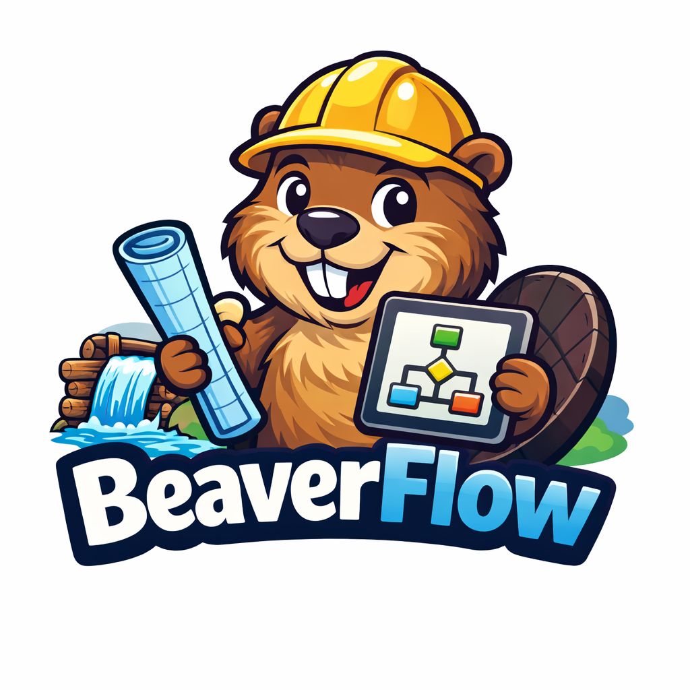

# BeaverFlow

BeaverFlow is a minimal agent workflow framework that makes research automate and systematic:

BeaverFlow does two things on purpose:

1. It defines a practical AI ↔ Codex agent loop that can handle non-trivial engineering tasks while keeping `task` and `acceptance` as separate truths.
2. It defines a lightweight multi-agent composition model (`A->B`, `A and B`, `loop(...)`) so workflows can be assembled like building blocks.

The core split is intentional:

- `agent.py` runs one agent and enforces `task`, `acceptance`, and optional `mindset`.
- `agent_workflow.py` composes multiple agents with a small workflow DSL such as `A->B`, `A and B`, and `loop(A->B, 3)`.


## What is stable in this repo

- `task` and `acceptance` stay separate.
- `mindset` is optional. If omitted, `agent.py` uses its built-in default engineering mindset.
- `loop(...)` is mechanical repetition. It does not stop early.
- Workflow-side agent definitions use class style only:

```python
A = Agent(
    name="A",
    script="./agent.py",
    workspace=WORKSPACE,
    task=A_TASK,
    acceptance=A_ACCEPTANCE,
)
```

Required fields:

- `name`
- `script`
- `workspace`
- `task`
- `acceptance`

Optional fields include `mindset`, `max_rounds`, `reset`, `dry_run`, `ai_model`, `codex_model`, and `codex_timeout_s`.

## Runtime layout

When an agent runs, BeaverFlow writes runtime state under the shared workspace:

```text
<workspace>/
  .agents/<agent-id>/...
  .workflow/shared/<channel>/...
```

These runtime directories are intentionally ignored by Git.

## Requirements

- Python 3.10+
- `openai` Python package
- `codex` CLI available in `PATH`
- the environment needed by your own task

## Quick start

Create a virtual environment and install dependencies:

```bash
python3 -m venv .venv
source .venv/bin/activate
pip install -r requirements.txt
```

Run the minimal sample in dry-run mode:

```bash
python3 agent_workflow_sample.py
```

It prints the commands that would be executed. To run it for real, set `DRY_RUN = False` in `agent_workflow_sample.py` and make sure your OpenAI and Codex environment is ready.

## Setup (OpenAI API + Codex CLI)

BeaverFlow needs both:

1. `OPENAI_API_KEY`
2. `codex` CLI in `PATH`

### 1) Install Codex CLI

```bash
npm install -g @openai/codex
codex --version
which codex
```

### 2) Set API key

```bash
export OPENAI_API_KEY="your_api_key_here"
echo "${OPENAI_API_KEY:+set}"
```

### 3) Install Python deps

```bash
python3 -m venv .venv
source .venv/bin/activate
pip install -r requirements.txt
```

### 4) Run

Dry run:

```bash
python3 agent_workflow_sample.py
```

Real run:

1. Set `DRY_RUN = False` in `agent_workflow_sample.py`
2. Run again:

```bash
python3 agent_workflow_sample.py
```

Single agent:

```bash
python3 agent.py \
  --workspace ./demo_ws \
  --task "Implement feature X" \
  --acceptance "All tests pass"
```

### Troubleshooting

- `codex: command not found`: make sure npm global bin is in `PATH`.
- OpenAI auth error: check `OPENAI_API_KEY`.
- Only prints commands: `DRY_RUN` is still `True`.

## Workflow DSL

Supported workflow expressions:

```text
A->B
A and B
loop(B, 20)
loop(A->B, 3)
A->loop(B, 20)
```

Semantics:

- `A->B`: run `A`, then `B`, on the same channel
- `A and B`: run both branches and write a branch manifest
- `loop(X, n)`: run `X` exactly `n` times

There is no retry primitive in the current design.

## Sample files

### `agent_workflow_sample.py`

A small writer/checker demo. It bootstraps one toy spec file under `demo_ws` and shows the basic loop shape.

### `agent_workflow_sample_autoalpha.py`

An automatic alpha/feature research project.

## Notes about the current interface

At the workflow layer, `Agent.task`, `Agent.acceptance`, and `Agent.mindset` are rendered as text templates. The workflow writes them into `.workflow/rendered/...` and then passes them to `agent.py` via `@file` arguments.

At the CLI layer, `agent.py` itself supports both inline text and `@path` for `--task`, `--acceptance`, and `--mindset`.

## License

This repository is released under the MIT License.
